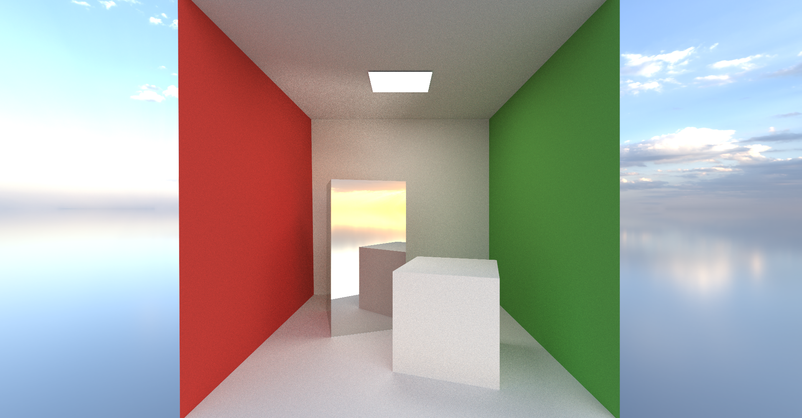
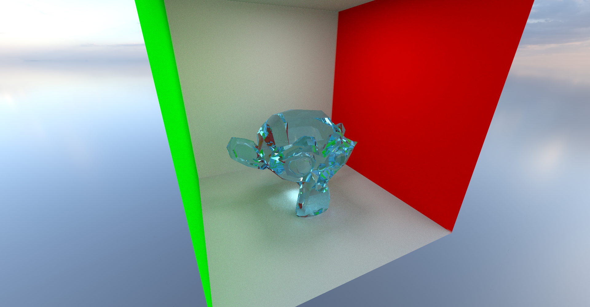
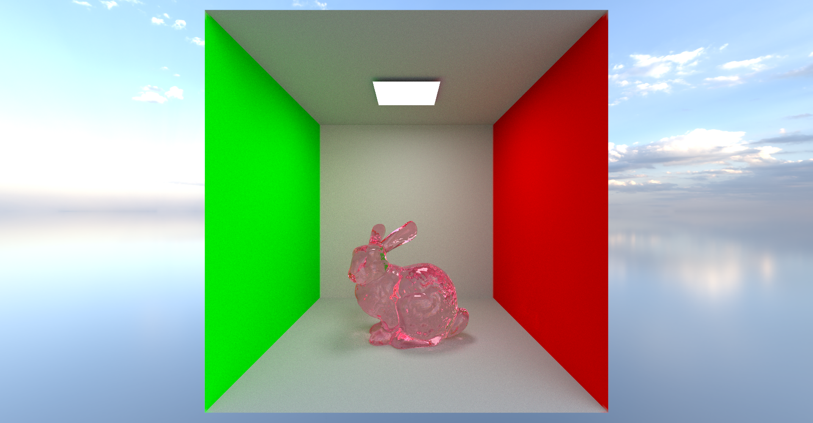

This repository is Vulkan version of my RaytracerOpenGL repository, where I made my own Vulkan wrapper.

Implemented:
- Saving image to file
- BVH accelearation structure on CPU
- Monte Carlo raytracing with frame accumulation on GPU compute shaders
- Importance sampling
- Scattering, Metal, Emmisive and Dielectric materials.
- Scenes loaded from GLTF files.

Examples of renders:

Parameters:
- 1024 samples,
- 8 bounces,
- 36 triangles including 2 emissive triangles.

Parameters:
- 1024 samples,
- 8 bounces,
- 980 triangles including 2 emissive triangles.

Parameters:
- 1024 samples,
- 8 bounces,
- 69463 triangles including 2 emissive triangles.

Parameters:
- 1024 samples,
- 8 bounces,
- 126052 triangles including 2 emissive triangles.

Parameters:
- 1024 samples,
- 16 bounces,
- 262315 triangles including 48 emissive triangles.
